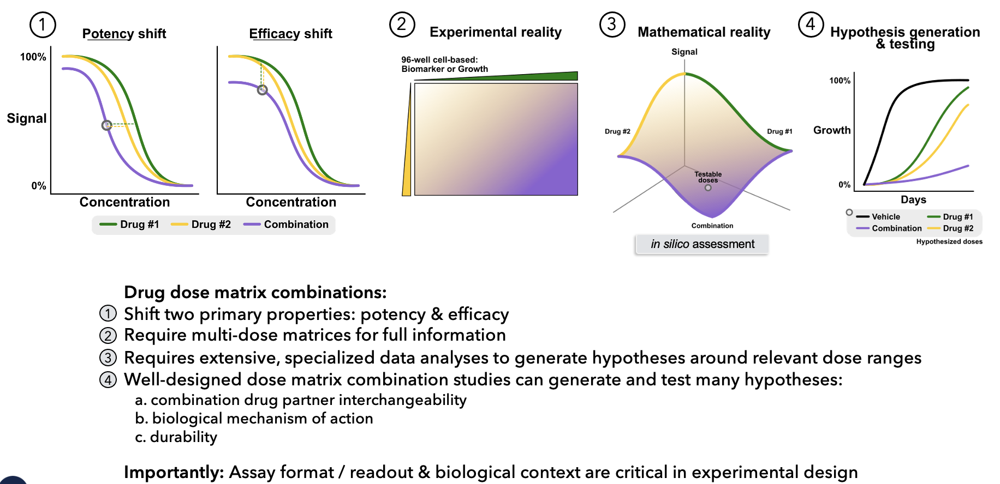
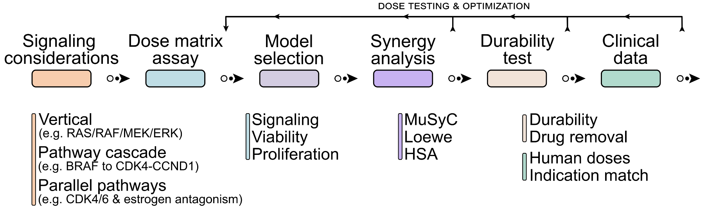

# musyc-app

### Information

The MuSyc app in its current state only predicts using the MuSyc model. Future developments will integrate the Loewe and HSA models. The backend is a python fastapi app that borrowed core code from `https://github.com/djwooten/synergy`.
The current fit algorithm leveraged in the MuSyC portal is described in the Methods section of Wooten et al. 2020. The authors use a Monte Carlo algorithm as suggested by Motulsky and Christopoulos (Chapter 17, pg 104) for estimating asymmetric 95% confidence intervals of each parameter. Briefly, this is done by fitting all the data using standard non-linear least squares regression (TFR option in SciPy's curve_fit). Based on this optimal fit, noise is added to every data point proportional to the root mean square error of the optimal fit. The new "noise-added" data is then fit again to generate a new parameter set. This process is run 100 times and the 95% confidence intervals for all parameters are calculated from the ensemble.

- U - Percent of unaffected population
- A1, A2 - Percent of affected by drug 1 and drug 2, respectively
- A1,2 - Percent of affected by both drug 1 and drug 2
- d1, d2 - Drug concentrations for drug pair
- Ed - Measured effect at (d1, d2)
- C1, C2 - The concentration of drug required to achieve 50% of the
- maximal effect (i.e., EC50)
- h1, h2 - Hill coefficients for dose-response curves of drug 1 and 2 in
- isolation
- E0 - The basal effect Ed (d1 = d2 = 0)
- E1, E2 - Maximal efficacy of drugs 1 and 2 in isolation
- E3 - Maximal efficacy of the combination of drugs 1 and 2
- β - Percent increase (or decrease) in max effect with both drugs over the most efficacious single drug (β = (min(E1,E2)-E3)/E0-min(E1,E2))
- α12 - Fold change in the potency (C2) of [d2] induced by drug 1
- α21 -Fold change in the potency (C1) of [d1] induced by drug 2
- γ12 - Fold change in the cooperativity (h2) of [d2] induced by drug 1
- γ21 - Fold change in the cooperativity (h1) of [d1] induced by drug 2

### Summary

This app allows users to drag n' drop `.csv` files with exactly 5 columns: (1)
`drug1.conc`, `drug2.conc`, `drug1.name`, `drug2.name` and `effect`, which will
generate a Score table of the `beta`, `alpha12`, `alpha21`, `gamma12`, and
`gamma21` coefficients. There is code to generate a 2D heatmap as well as a 3D
surface plot, however that has not been entirely implemented for production,
only for development and testing.

### Accessing app

Run `npm run start` in frontend directory. Run `python main.py` in backend directory. Ensure the python environemnt has all the libraries from `requirements.txt`. Access `localhost:3000` which will point to the `CsvUpload` component. Users can drag n' drop `.csv` files to generate the Score table.

### Architecture

ReactJS frontend and fastapi python backend. Postgres is a dependency for testing
of public sample datasets extracted from: `http://drugcombdb.denglab.org/`. Source file: `drugcombs_response.csv`

### Testing

Browse to `http://localhost:3000/test?compound_id=${FT_NUMBER}`
where `FT_NUMBER` is any valid compound id that is stored in database. Currently as of writing this documentation, it is a fixed list that is saved in the backend application, named `ft_nbrs.py`
